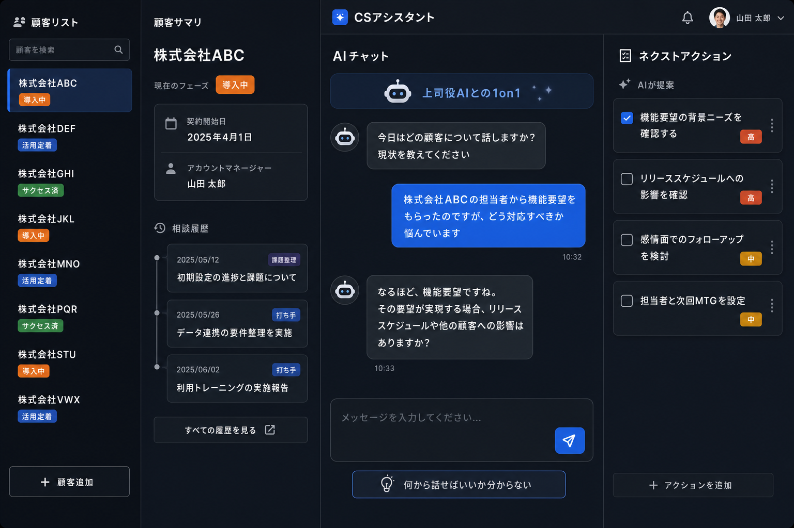

# CSアシスタント 設計決定まとめ

grill-meセッションで決定した内容の記録。

## プロダクト概要

**ツール名**：CSアシスタント  
**対象**：SaaSシフト管理ツール会社のCSチーム（メンバーが一人で使う）  
**役割分担**：Notion・HubSpotと被らない「どう進めるかを考える作業台」に特化

## 解決する課題

### 課題① プロジェクト管理力の弱さ
目の前のタスク（機能要望・質問）に反応するが、「木の幹」を見失う。
- スケジュール・本質ニーズ・依存関係・発生タスクを同時に考えられない

### 課題② 打ち手の単一性
何でも「機能説明」で解決しようとする。
- 感情面・関係性・信頼構築など非機能的アプローチが出てこない

**根本原因**：クリティカルシンキング＋ロジカルシンキングの不足

## 核心コンセプト

「上司役AIとの1-on-1対話」でクリティカル／ロジカルシンキングを引き出す。

- 週1の1-on-1以外のタイミングでも、いつでもリーダーの思考にアクセスできる
- Geminiを場当たり的に使う問題（履歴がバラバラ・品質がブレる）を解消
- 顧客ごとに相談履歴が貯まる

## 4ペイン構成

| ペイン | コンポーネント名（移行予定） | 役割 |
|--------|---------------------------|------|
| ① 顧客リスト | CustomerListPane | 担当顧客一覧・フェーズ表示・検索 |
| ② 顧客サマリ | CustomerSummaryPane | 選択顧客の基本情報・相談履歴タイムライン |
| ③ AIチャット | AIChatPane | 上司役AIとの1-on-1対話（チャット形式）|
| ④ ネクストアクション | NextActionPane | チャットから生成されるチェックボックス一覧 |

## ペイン③ 詳細

- 入力形式：AIリアルタイム対話（チャット形式）
- 「何から話せばいいか分からない」ボタン → grill-me式の問いかけが始まる
- AIが単なる回答者ではなく「問いを返す上司」として機能するプロンプト設計が核心

## 参考画像

## 実装フェーズ

- **フェーズ1（今月）**：画面の見た目のみ。データ保存・AI連携はなし
- **フェーズ2以降**：AI連携・顧客データ保存・Notion/HubSpot連携
