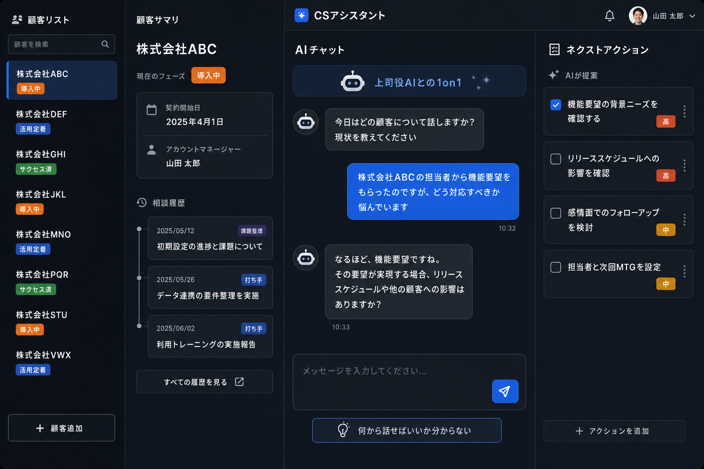

# CSアシスタント 設計決定まとめ

grill-meセッションで決定した内容の記録。

## プロダクト概要

**ツール名**：CSアシスタント  
**対象**：SaaSシフト管理ツール会社のCSチーム（メンバーが一人で使う）  
**役割分担**：Notion・HubSpotと被らない「どう進めるかを考える作業台」に特化

## 解決する課題

### 課題① プロジェクト管理力の弱さ
目の前のタスク（機能要望・質問）に反応するが、「木の幹」を見失う。
- スケジュール・本質ニーズ・依存関係・発生タスクを同時に考えられない

### 課題② 打ち手の単一性
何でも「機能説明」で解決しようとする。
- 感情面・関係性・信頼構築など非機能的アプローチが出てこない

**根本原因**：クリティカルシンキング＋ロジカルシンキングの不足

## 核心コンセプト

「上司役AIとの1-on-1対話」でクリティカル／ロジカルシンキングを引き出す。

- 週1の1-on-1以外のタイミングでも、いつでもリーダーの思考にアクセスできる
- Geminiを場当たり的に使う問題（履歴がバラバラ・品質がブレる）を解消
- 顧客ごとに相談履歴が貯まる

## 4ペイン構成

| ペイン | コンポーネント名（移行予定） | 役割 |
|--------|---------------------------|------|
| ① 顧客リスト | CustomerListPane | 担当顧客一覧・フェーズ表示・検索 |
| ② 顧客サマリ | CustomerSummaryPane | 選択顧客の基本情報・相談履歴タイムライン |
| ③ AIチャット | AIChatPane | 上司役AIとの1-on-1対話（チャット形式）|
| ④ ネクストアクション | NextActionPane | チャットから生成されるチェックボックス一覧 |

## ペイン③ 詳細

- 入力形式：AIリアルタイム対話（チャット形式）
- 「何から話せばいいか分からない」ボタン → 相談の入り口（把握のきっかけ）
- 通常1on1は本物のマネジャー相談のように自然進行（手動モード選択なし）
- AIチャット入力下に「回答は正確とは限らない」注記を表示

## 通常1on1のスタンス（2026-07 更新）

### 解決したいこと
- 「なんで？なんで？」連鎖で重く、使われなくなること
- 答えの丸渡しでもなく、気づき＋方向づけ（ティーチング＋コーチング）が欲しい

### 進行モデル（温度で省略可。毎回フル強制ではない）
1. 把握 — 足りないときだけ軽い問い
2. 確認 — 「つまりこういうこと？」（原則1回。連打しない）
3. 打ち手の提示 — 「こんな打ち手もありそう。どう思う？」（※提案モードとは別）
4. 意思 — 「あなたはどうしたい？」
5. 合意 — 「ならこれで進めるのが良いんじゃない？」→ 整理／提案を作るへ短く案内

### why ルール
- どの段でも「なぜ？」は1つまで可。返ってきたら見立て／打ち手へ戻る
- 連続 why（尋問）は禁止

### ボタンの役割（ショートカット。必須操作ではない）
| 操作 | 役割 |
|------|------|
| 別の視点を出す | 行き詰まり時の横移動（見立て差し替え） |
| 打ち手を考える | 打ち手の提示段への加速 |
| ここまでを整理 | 合意後の着地確定 |
| 提案を作る | 合意後の通し方文書化（別モード） |
| プレゼンを作る | 提案文書後の読み上げ原稿（別モード。提案ピンがあるときだけ表示） |

### 合意の出口
- AIはチャット本文で整理／提案ボタンへ短く案内する
- `readyToLand: true` は「進め方に合意し、整理してよい」とき
- 本文に次アクション箇条書きは書かない（着地カード担当）

## 提案作成モード（2026-07 追加）

壁打ち／1on1で打ち手（NA）が固まったあと、「誰にどう通すか」の提案文書を作るための手動モード。

### 役割分担
- 通常1on1 / grill-me: 課題の壁打ちと打ち手
- 提案モード: 通し方の文書化（新しい打ち手の Invent ではない）
- プレゼンモード: 尺のある場で「話して通す」読み上げ原稿（下記）

### 起動・終了
- 「提案を作る」を常時表示（モード切替CTA）。NAあり時は強調可
- 手動起動のみ。提案モード中は進行3ボタン（視点／打ち手／整理）を隠す
- ヘッダーを差し替え、「通常に戻る」で終了。文書出力後もモードは履歴上終了扱い
- NAなしでも起動可（短路）。NAありなら材料①に仮置き

### UI
- 提案モード中のみ選択肢チップ＋自由入力。通常チャットは自由入力のまま
- 宛先は1問目で顧客向け／社内向けを選択。以降ヘッダーにチップ表示
- 成果物はチャット内の提案文書カード＋入力欄上の成果物ピン（コピー可）
- 着地カード／Pane④ NA とは分離（提案文を着地に流し込まない）

### 技術メモ
- system prompt は提案中だけ差し替え。history は提案開始 intent 以降のみ
- meta は通常 `readyToLand` と提案 `mode:"proposal"` を排他。提案中は自動着地しない
- `kind`: `proposal_question` / `proposal_document`。options は landing の `card` と別スキーマで同 JSON 列に保存

## プレゼン作成モード（2026-07 追加）

提案文書ができたあと、「会議などでどう話すか」の読み上げ原稿を作る手動モード。writing-presentations スキルの移植。スライド／pptx 生成は v1 ではやらない。

### 役割分担
- 通常1on1: 何をするか（打ち手）
- 提案モード: 書いて通す（提案文書）
- プレゼンモード: 話して通す（読み上げ原稿）。新しい打ち手の Invent でも、提案文書の代替でもない

### 起動・終了（迷い防止の段階表示）
- 「プレゼンを作る」は提案文書ピンがあるときだけ表示。accent（黄）で強調
- ボタン名は「プレゼンを作る」のまま。常時注記は出さず、ホバー title で役割を示す（提案＝書いて通す／プレゼン＝話して通す読み上げ原稿。スライドは別）。モード開始後ヘッダーでも補足する
- 入力欄上の左ヒント文（「相談がまとまったら…」等）は出さない。「相談を終了」ダイアログが履歴の可否を担うため冗長
- 手動起動のみ。プレゼン中は進行3ボタンと「提案を作る」を隠す
- ヘッダー差し替え＋「通常に戻る」。原稿出力後もモードは履歴上終了扱い
- 状態は常に `normal` / `proposal` / `presentation` のどれか1つ（同時起動しない）

### UI
- 場・尺・たとえなど選べる質問は選択肢チップ。場面・心の声は自由入力のみ
- 成果物はチャット内の読み上げ原稿カード
- 入力欄上のピンは1枠。タブで「提案／原稿」を切替（デフォルトは最後に生成した方）
- 着地カード／Pane④ NA とは分離

### 創作禁止（提案・プレゼン共通）
- 体験談・場面・心の声・固有の数字を AI がでっち上げない
- 抽象語だけで書かず、足りなければ質問を続ける
- プレゼンは `episodePresent` が true になるまで `phase:"script"` を受理しない

### 技術メモ
- `chatMode` で API の prompt / history 切り出しを分岐。サーバは intent 境界でも再検証
- system prompt はプレゼン中だけ差し替え。history はプレゼン開始 intent 以降のみ。最新提案文書は prompt にシード
- meta: `mode:"presentation"` + `phase:"ask"|"script"`。通常の `readyToLand` と排他。自動着地しない
- `kind`: `presentation_question` / `presentation_script`

### やらないこと（v1）
- pptx / スライドビジュアル生成
- 提案なしでのプレゼン単独起動（入口は提案文書後）
- 原稿のインライン手編集（コピー＋具体を足して出し直し）

## 参考画像

## 実装フェーズ

- **フェーズ1（今月）**：画面の見た目のみ。データ保存・AI連携はなし
- **フェーズ2以降**：AI連携・顧客データ保存・Notion/HubSpot連携

## 認証（2026-07）

チーム展開前のアクセス制御。データ分離・作成者記録は後続。

| 項目 | 決定 |
|------|------|
| 方式 | Auth.js v5 + Google OAuth |
| 許可 | `ALLOWED_EMAILS`（カンマ区切り）。未設定・空は全員拒否 |
| スコープ | `/cs`・`/api/cs/*`・CS Server Actions のみ。キット `/` は公開 |
| データ | 共有ワークスペースのまま（ユーザー分離なし） |
| 表示名 | `cs_settings.id = ログインメール` で人ごと保存。未設定時は Google 名。顧客の担当CSとは別（一括同期しない） |
| 認可の正本 | RSC / API / Server Actions 内の `auth()`。`proxy.ts` は UX 用リダイレクト |

必要な env: `AUTH_SECRET` / `AUTH_GOOGLE_ID` / `AUTH_GOOGLE_SECRET` / `AUTH_URL` / `AUTH_TRUST_HOST` / `ALLOWED_EMAILS`（詳細は `.env.example`）
